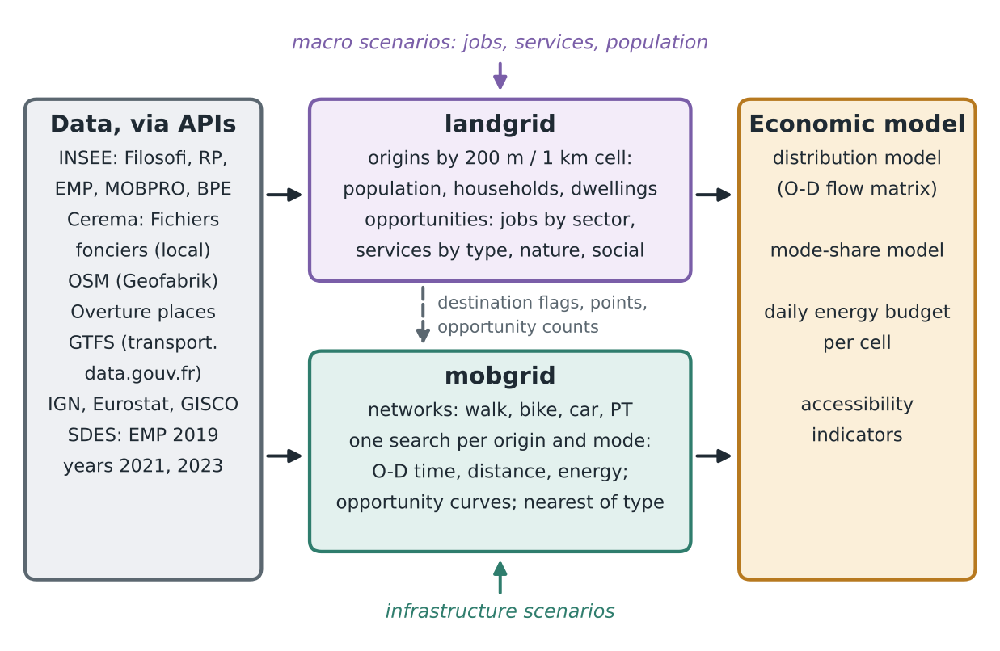
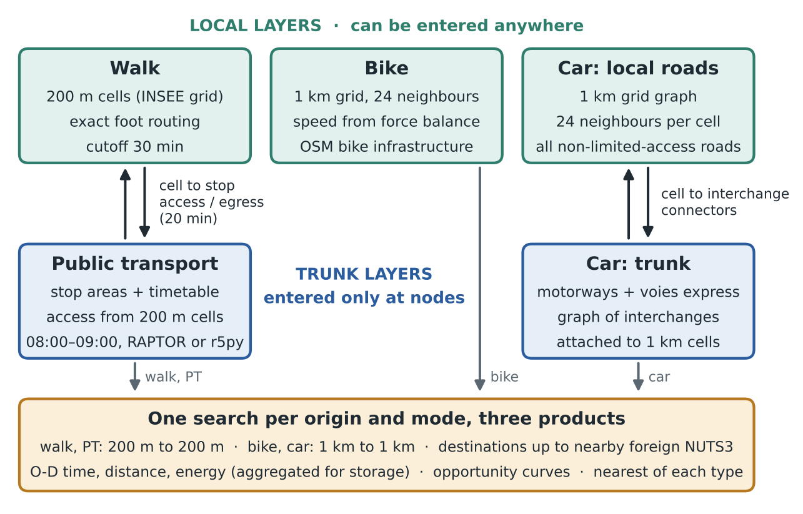

# 3. Architecture overview

Figure 1 shows how the work splits. `landgrid` turns census, tax and POI data into origins and opportunities per cell, year and scenario, and flags every destination cell by opportunity type. `mobgrid` turns networks and timetables into O-D costs and accessibility products. The economic model combines both. Macro scenarios act on `landgrid`, infrastructure scenarios on `mobgrid`; the only flow between the two modules is the destination flags, representative points and opportunity counts that `landgrid` provides to `mobgrid`.

_Figure 1. Two modules: land use (origins and opportunities) and networks (O-D costs and accessibility), feeding the economic model._

Figure 2 shows the network layers and how they connect. Local layers (walk, bike, local roads) are gridded or point-based. Trunk layers (motorways, PT) keep their nodes and are reached through access links: cell-to-stop walking times for PT and cell-to-interchange driving times for motorways. Both trunk layers share one logic: access, trunk, egress.

_Figure 2. Network layers. Local layers feed the trunk layers through access links; every search fills three products._

The table separates the network elements a layer is made of, the cells between which costs are computed, and what is stored.

| Layer | Network elements | Origins and destinations | Stored O-D table | Changed by |
|---|---|---|---|---|
| Walk | OSM foot edges | 200 m cells | 200 m pairs within 30 min, in full | New paths, footbridges, new stops |
| Bike | 1 km grid graph (24 neighbours); edges from exact bike paths with OSM bike infrastructure | 1 km cells | 1 km pairs | Bike infrastructure, car-to-bike conversions |
| Car local | 1 km grid graph (24 neighbours), all non-limited-access roads | 1 km cells | 1 km pairs; far destinations optionally in 5 and 10 km bands | Speed limits, new or removed roads, urban extensions |
| Car trunk | Interchanges and directed links (`motorway`, `trunk` + `motorroad=yes`) | 1 km cells, through connectors | As car local | New sections or interchanges, speed limits |
| PT | Stop areas and timetables (GTFS, France + border feeds) | 200 m cells, on foot to and from stops | Aggregated to 1 km pairs | New lines, extensions, stations, frequency, speed, comfort |

Accessibility products (opportunity curves, nearest destination of each type) are always computed at the resolution of the first two columns, whatever the storage of the O-D table (section 10.2).

**Why the car trunk is not a 1 km grid.** Motorways can only be entered at interchanges. Gridding them would let traffic join or leave in any cell, which is the "cracks" bias. The trunk layer therefore has no resolution of its own: it is entered from, and reports to, the same 1 km cells as the local car layer, through connectors at each interchange.

**Why PT stops are not merged by 200 m cell.** Merging stops by cell would create zero-cost transfers between stops up to 280 m apart inside a cell, and would separate stops a few metres apart on either side of a cell boundary. Stop areas (`parent_station`, or same name within about 100 m) are the logical unit of the network; the 200 m resolution applies to access: each 200 m cell gets walking times to the stop areas within reach, so PT costs are natively 200 m to 200 m.
