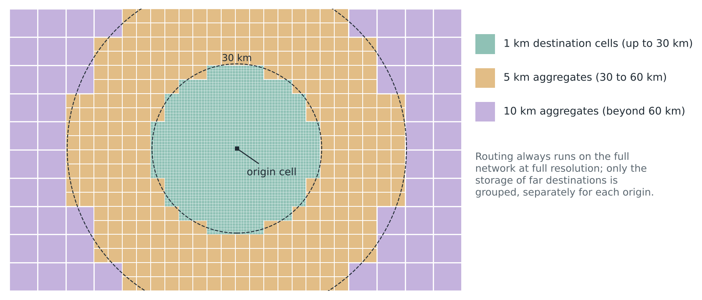

# 4. Spatial frame

## 4.1 Grids

All grids follow the INSPIRE-compatible LAEA grid (EPSG:3035) used by INSEE and Eurostat. INSEE's 200 m and 1 km cells nest exactly (25 sub-cells per 1 km cell), so population and income come straight from the Filosofi gridded data. The Eurostat 2021 census 1 km grid, on the same frame, serves to validate origins and gives residential change. Cell identifiers follow the INSPIRE naming so every table joins on one key.

## 4.2 Representative points

- Each 200 m cell has one point: the dwelling-weighted centre of its Fichiers fonciers premises when inhabited, the opportunity-weighted centre otherwise, snapped to the foot network.
- Each 1 km cell gets a population-weighted point computed from its 200 m sub-cells and snapped to the relevant network. Cells with opportunities but no residents use an opportunity-weighted point.
- Option to test in the pilot: a second "through" node on the main road crossing the cell, linked to the population point. This reduces the detour error that builds up when long paths must pass through every centroid.

## 4.3 Study area

- **Origins:** inhabited cells of metropolitan France. Corsica is a separate component; ferry links are out of scope for now.
- **Destinations:** France plus foreign NUTS3 regions adjacent to the border (Belgium, Luxembourg, Germany, Switzerland, Italy, Monaco, Spain, Andorra), extendable to NUTS2.
- **Routing network:** destinations plus a halo of about 50 km, so that French-to-French trips can transit abroad when faster.
- **Abroad, only jobs and nature.** No origins, population, services or social destinations are computed outside France.
    - Jobs: NUTS3 employment at place of work (Eurostat `nama_10r_3empers`, 2021 and 2023) allocated with the Overture method already validated in France (section 7.2). This matters most for the job centres French cross-border workers go to (Luxembourg-Kirchberg, Geneva, Basel), which have few residents.
    - Nature: OSM, as in France.

## 4.4 Tiles

Computation runs on tiles, for example 50 km × 50 km in EPSG:3035. Each tile carries a halo equal to the relevant mode's cutoff distance, so tiles are processed independently and in parallel. Trunk layers remain national.

## 4.5 Resolution, destinations and storage

**Resolution by mode.** Walk and PT are computed from 200 m cells to 200 m cells: walking access to and from stops is computed at 200 m, so PT inherits that resolution. Bike and car are computed from 1 km cells to 1 km cells.

**One destination grid with flags.** At each resolution, every cell carries a flag per opportunity type: jobs, each service type, each nature class, social (population above a threshold) and PT stop classes. A cell with at least one flag is a destination. A search reaches each destination once per origin and mode, whatever the number of types it holds, and records its cost only if it is reachable within the cutoff; cells without flags are crossed but not stored.

**Accessibility is never computed from stored aggregates.** Cumulative and radiative measures need the cost to each individual destination, which aggregation destroys. They are therefore computed during the search, at full resolution, as opportunity curves and nearest destinations of each type (section 10.2). Aggregation then only concerns the storage of the O-D table used by the distribution model.

**Storage of the O-D table.** Walk is stored in full at 200 m. PT is aggregated to 1 km pairs: population-weighted over the origin's 200 m sub-cells, opportunity-weighted over the destination's sub-cells, plus the minimum. Bike is stored at 1 km. Car is stored at 1 km up to 30 km, then optionally in nested 5 km and 10 km cells (Figure 3), each storing the opportunity-weighted mean time, distance and energy, their minimum, maximum and spread, and the total of opportunities. The band limits are parameters, set after the pilot. What is stored also decides what a land-use change costs (section 11.1).

_Figure 3. Optional storage bands for car destinations around one origin (illustration). The partition is nested: 25 cells of 1 km form a 5 km cell, four 5 km cells form a 10 km cell._

The table summarises what each product keeps.

| Product | Resolution | Aggregated? | Used for |
|---|---|---|---|
| Opportunity curves (section 10.2) | Origin at 200 m (walk, PT) or 1 km (bike, car); every destination counted at full resolution | No: binned by cost (time, distance, energy) | Cumulative and radiative accessibility; intervening-opportunity models |
| Nearest destinations of each type | Same | No | First service or nature area in reach; access to PT stops |
| O-D table (job and social destinations) | As computed | Only for storage: PT to 1 km, car beyond 30 km optionally | Distribution model, mode-share model, daily energy, monetary cost |

**Distribution model with aggregated alternatives.** When far car destinations are stored in bands, the destination-choice model stays consistent if utilities include ln(opportunities) as a size term with a heterogeneity correction (Ben-Akiva & Lerman 1985); alternatively the model is estimated on a sample of 1 km alternatives (McFadden 1978).

> **Order of magnitude.** Metropolitan France has about 544,000 km², hence about 544,000 cells at 1 km and 13.6 million at 200 m; the 2021 census grid counts 374,622 inhabited 1 km cells, and about [TO CONFIRM: 2.3 million] 200 m cells are inhabited. Walking at 30 minutes (2.4 km at 4.8 km/h) reaches about 450 cells of 200 m, about 1 billion walk pairs. Storing PT at 200 m to 200 m within 60–90 minutes would mean tens of billions of pairs, hence the aggregation to 1 km for storage. Car needs about 3,800 destinations per origin with bands (2,800 at 1 km, 340 at 5 km, 590 at 10 km), about 1.4 billion pairs from inhabited cells, roughly 14 GB uncompressed for time, distance and energy as 16-bit integers. Bike needs about 700 destinations per origin within 15 km.
