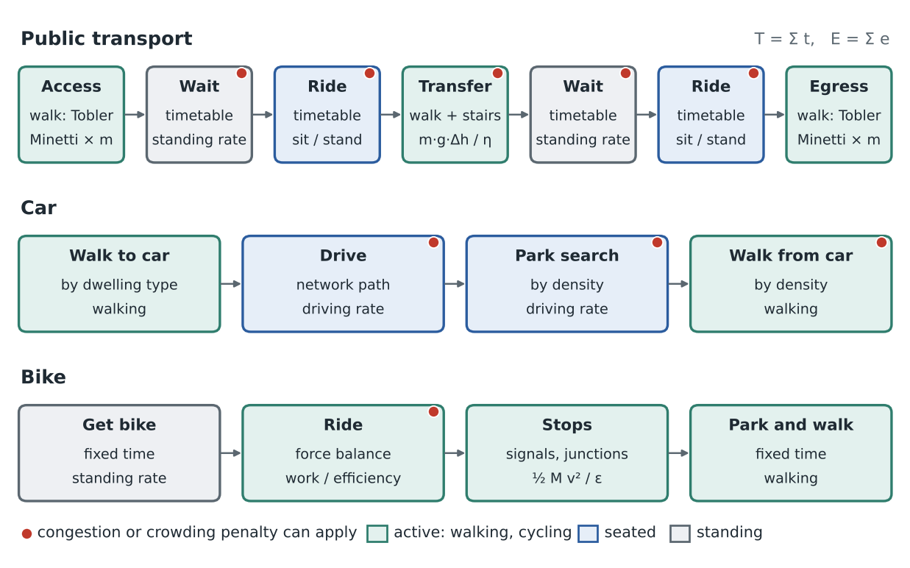

# 9. Trip legs: time and bodily energy

## 9.1 Unit and conventions

- **Energy above rest,** in kJ for a reference adult of mass m, the mean body mass of adults in France: about 74 kg (men about 81 kg, women about 67 kg in the Esteban study 2014–2016 of Santé publique France, weighted by the adult sex ratio). Energy is also reported in net MET-minutes: one net MET-minute is 0.0175 kcal/kg × 4.184 kJ/kcal × m = 0.0732 × m kJ, i.e. 5.42 kJ at 74 kg and 5.13 kJ at 70 kg. The numerical examples of this section use 70 kg, the convention of the literature.
- **Two sets of rates, chosen in configuration:** **KH**, the ergonomic values used by Kölbl & Helbing (2003), from Spitzer, Hettinger & Kaminsky (1982), in kJ per minute above rest; and **Compendium** (Ainsworth et al. 2011; Herrmann et al. 2024), in METs. The daily budget of section 9.9 is re-estimated with the same set as the O-D costs.
- **Body mass is explicit.** Walking costs are proportional to m; cycling separates mass-proportional work from drag; sedentary rates are per kilogram in the Compendium and for a reference adult in KH.
- **Physical quantities only.** Outputs are time and energy. Perceived penalties (for transfers, crowding, discomfort) belong to the mode-choice model; where crowding or congestion changes the body's energy use, the rates below change.

## 9.2 A trip is a chain of legs

Every trip is built from legs (Figure 4). Its time and energy are sums over legs: T = Σ t, E = Σ e. Sedentary and standing legs have e = r × t with a rate r; walking and cycling legs use physical models along the path. The same formulas serve the O-D computation, the scenario engine and the re-estimation of the daily budget on EMP 2019 (section 9.9).



_Figure 4. Trips as chains of legs, with the time and energy model of each leg; red dots mark the legs where congestion or crowding act (section 9.8)._

The legs use these reference rates, in kJ per minute above rest for 70 kg; Compendium values are given with their 2024 code:

| Activity | KH (Spitzer et al. 1982) | Compendium 2024: code, MET → kJ/min | Used for |
|---|---|---|---|
| Sitting in a vehicle | 1.5 | 16016 riding in a bus or train, 1.3 → 1.5 (16015 car, same) | Seated PT ride, car passenger |
| Standing, relaxed | 2.6 | 07041 standing, fidgeting, 1.5 → 2.6 (07040 quietly, 1.3) | Waits; standing ride without crowding |
| Standing, restless | 6.7 | — | Crowded standing ride (upper bound) |
| Car driving, clear roads | 4.2 | 16010 driving, 2.0 → 5.1 | Driving, free flow |
| Car driving, test drive | 8.0 (5.9–12.6) | — | Cap of the congestion penalty |
| Car driving, city rush hour | 13.4 | — | Upper bound only |
| Walking to or from a car or bus | — | 17161, 2.5 (estimated) → 7.7 | Check of short terminal walks |
| Walking, flat, 4 km/h | 14.1 | 17170 (2.5 mph), 3.0 → 10.3 | Walking formula, KH or Compendium level |
| Walking, flat, 5 km/h | 18.0 | 16060 walking for transportation (2.8–3.2 mph), 3.5 → 12.8 | Same |
| Climbing stairs | — | 17131 general, 6.8 → 29.7; 17133 slow, 4.5 → 17.9 | Check of the stairs formula |
| Descending stairs | — | 17070, 3.5 → 12.8 | Same |
| Cycling, flat, 12 km/h | 14.7 | 01010 under 10 mph, 4.0 → 15.4 | Check of the cycling physics |

## 9.3 Walking legs

Access and egress to stops, transfers, walking trips, and walks to and from cars and bikes all use the same formulas, applied segment by segment along the path (gradient i, length L):

```text
v(i)  = v0 · exp(−3.5·|i + 0.05|) / exp(−0.175)
t     = Σ L / v(i)
e     = m · c0 · Σ L · g(i)
g(i)  = Cw(i) / Cw(0)
Cw(i) = 280.5 i^5 − 58.7 i^4 − 76.8 i^3 + 51.9 i^2 + 19.6 i + 2.5    (J/kg/m)
```

The speed is Tobler's (1993) hiking function rescaled so that v(0) = v0; Cw is the net cost of walking measured by Minetti et al. (2002).

- **Parameters:** v0 = 4.8 km/h, to be checked on the walking trips of EMP 2019 (declared durations and distances); c0 is the net cost per kilogram and metre on the flat: 2.29 J/kg/m with the Compendium (3.5 MET at 4.8 km/h) or 3.0 J/kg/m with KH (14.1 kJ/min at 4 km/h for 70 kg). Minetti et al. measured a minimum of 1.64 J/kg/m at 1 m/s on a treadmill. For 70 kg and 1 km on the flat: 160 kJ (Compendium) or 211 kJ (KH).
- **Gradient factor:** g = 1.44 at +5%, 1.96 at +10%, 0.45 at −10%; the polynomial is valid from −45% to +45%.
- **The m·g·h term is already inside.** The extra cost of climbing, Cw(i) − Cw(0), equals the vertical work g·i divided by an apparent efficiency of about 0.45 at +5% and 0.34 at +30%. Since e is multiplied by m, climbing energy is proportional to body mass, as m·g·Δh is; adding m·g·Δh separately would count it twice.
- **Stairs and level changes** (stations, footbridges, underpasses). Proposed values, consistent with the Compendium:

```text
t_up   = Δh / 0.20 m/s      e_up   = m·g·Δh / 0.30
t_down = Δh / 0.30 m/s      e_down ≈ e_up / 3
```

Climbing at 0.20 m/s with an efficiency of 0.30 is about 6.4 MET, close to the Compendium's general stair climbing (17131, 6.8 MET); descending at 0.30 m/s at the Compendium's 3.5 MET (17070) costs about a third of climbing. Climbing 10 m costs about 23 kJ for 70 kg, as much as 140 m of flat walking. Escalators and lifts are taken at the standing rate; escalators are assumed in stations deeper than 10 m. OSM levels are rarely complete, so height differences come from the type of station:

| Place | Height difference | Note |
|---|---|---|
| Bus stop; tram or metro stop at street level | 0 |  |
| Rail platform change by underpass | 4 m down, then 4 m up |  |
| Rail platform change by footbridge | 7 m up, then 7 m down | Clearance above electrified tracks |
| Shallow underground station (older metro lines) | 6 m |  |
| Deep underground station (RER, newer metro lines) | 15 m | Escalators |
| Very deep station (e.g. Grand Paris Express) | 25 m | Escalators and lifts |

The heights are checked on a sample of stations.

- **Later:** carried loads for shopping trips (Pandolf, Givoni & Goldman 1977); walking speed in crowded stations (Fruin 1971).

## 9.4 Waiting and transfers

- **Time from timetables.** Range RAPTOR includes the initial wait in the median over the departure window, and transfer waits in each journey. A minimum transfer time applies: 2 min within a stop area, 3–5 min for rail.
- **Frequency-based approximation,** used when a scenario changes headways before timetables are regenerated:

```text
w = (h / 2) · (1 + CV²)      headways up to about 10–12 min: random arrivals
w = w_planned                longer headways: passengers time their arrival
```

h is the mean headway and CV the coefficient of variation of headways (Larson & Odoni 1981; Holroyd & Scraggs 1966). CV is zero in a timetable and positive when service is irregular: this is the reliability penalty. The limit between the two regimes is 10–12 min and w_planned = 4 min.

- **Without real-time data,** CV takes default values by mode and right of way, read from the headway-adherence levels of service of the TCQSM (Kittelson & Associates et al. 2003): A up to 0.21, B 0.22–0.30, C 0.31–0.39, D 0.40–0.52, E 0.53–0.74. Proposed: metro and rail 0.15 (A), tram on reserved track 0.25 (B), bus on bus lanes 0.35 (C), bus in mixed traffic 0.45 (D), bus in congested centres 0.60 (E). With the congestion module, the CV of buses in mixed traffic rises with the congestion index of their route.
- **Checks on EMP 2019.** EMP records door-to-door trip durations but not waits or headways, so it cannot test the CV values directly. It can test them together: modelled PT door-to-door times, which include the waits, are compared with declared PT trip durations by mode and density class; a systematic gap points to the waits, w_planned or the CV defaults.
- **Energy:** e = r_wait × w, with r_wait at the standing-relaxed rate (KH 2.6 kJ/min; Compendium 07041).
- **Transfer legs** combine a walking leg on the foot network, the level change between platforms, and the wait for the next departure.

## 9.5 Riding public transport

- **Time:** from the timetable; scenario edits change it. Later: dwell times grow with boardings and alightings (TCQSM 2013), and buses in mixed traffic follow car congestion except on bus lanes.
- **Energy:** a mix of sitting and standing that depends on the load factor LF (passengers per seat):

```text
r_ride  = (1 − p_s) · r_sit + p_s · r_stand(LF)
p_s     = max(0, 1 − 1/LF)                 share of riders standing
r_stand = r_relaxed + (r_restless − r_relaxed) · clamp((LF − 1)/(LF_max − 1), 0, 1)
```

with r_sit = 1.5, r_relaxed = 2.6 and r_restless = 6.7 kJ/min (KH), and LF_max the crush load per seat, by vehicle type (below). Kölbl & Helbing note that sitting and standing in a moving vehicle cost more than at rest because of balancing. No separate vehicle factor is needed: the Compendium already rates riding a bus or train (16016) at 1.3 MET against 1.0 for sitting quietly (07021), and the dynamic part, crowding, comes from the load factor, which follows the flows of the model.

Proposed crush loads per seat (seats plus standing room at about 4 passengers per m², divided by seats) [TO CONFIRM: against operators' vehicle data]:

| Vehicle | LF_max |
|---|---|
| Metro | 4.0 |
| Tram | 4.0 |
| Urban bus (standard or articulated) | 3.0 |
| RER and suburban trains (Transilien) | 2.5 |
| TER | 1.8 |
| Intercités | 1.3 |
| Interurban coach | 1.2 |
| TGV, long-distance coach | 1.1 |

- **First phase, without load data:** standing shares for 08:00–09:00: metro 0.5, tram 0.4, urban bus 0.3, TER 0.15, TGV 0. **Later:** LF from PT flows assigned with the stored route groups, so crowding raises energy (restless standing) and, at crush load, waiting (denied boarding).
- **Service quality in scenarios:** better frequency reduces waits; more capacity or seats lowers the standing share and its rate; closer stops shorten egress. All three change time and energy through these formulas.

## 9.6 Car legs

- **Walk to the car:** t = s_house · t_house + (1 − s_house) · t_apt(density), where s_house is the share of houses among the origin cell's dwellings (Fichiers fonciers `dteloc`), with t_house about 0.5 min and t_apt 1–4 min by density class. Energy from the walking formula.
- **Drive:** time from the car graph (free flow now, congested later). Energy at the driving rate, which rises with congestion:

```text
r_drive = r_free + (r_cong − r_free) · clamp((ρ − 1)/(ρ_max − 1), 0, 1)
ρ       = congested time / free-flow time on the path
```

with r_free = 4.2 (KH) or 5.1 kJ/min (Compendium), r_cong = 8.0 kJ/min (the test-drive value of KH; the rush-hour value of 13.4 is only an upper bound) and ρ_max = 2. Passengers sit (1.5 kJ/min).

- **Parking search** at the destination: t_ps by density class of the destination cell: about 0 in rural areas, 0.5 min suburban, 2 min urban, 5 min in dense centres (Shoup 2006), later a function of parking supply and occupancy; energy at the driving rate.
- **Walk from the car:** t_e by density class of the destination cell, 0.5 to 5 min; walking formula. Kölbl & Helbing explain the higher daily energy of car passengers by such walks, which is why they must be counted.

## 9.7 Bike legs

- **Get the bike and park it:** fixed times, about 1 min each, more for apartment buildings, at the standing or walking rate. Shared bikes later (walk to and from the dock).
- **Ride:** on each edge of slope i = tan θ, the speed v solves the force balance (di Prampero et al. 1979; Martin et al. 1998):

```text
P_r · η_d = v · [ M·g·(C_rr·cos θ + sin θ) + ½·ρ_air·C_dA·(v + v_w)² ]
M = m + m_bike,   η_d ≈ 0.976 (drivetrain)
P_r = P_0 on the flat
P_r = min(P_0·(1 + k·i), P_max) on climbs
P_r = 0 on descents, where v = v_max,desc
```

P_0, k and P_max are calibrated on observed commuter speeds on gradients (Parkin & Rotheram 2010); speeds are capped by infrastructure class and on descents.

- **Stops** at signals and junctions, with a probability by infrastructure class: time = deceleration + expected wait + acceleration (for a random arrival at a signal of cycle C and red time R, the expected wait is R²/(2C); Webster 1958); energy ½·M·v²/ε to regain speed, about 3.5 kJ at 16 km/h for M = 85 kg.
- **Energy:**

```text
e = [ M · (W_roll + W_climb + W_stops) + W_drag ] / ε
W_roll  = Σ g·C_rr·cos θ·L        (per kg, pedalled edges)
W_climb = Σ g·Δh+                 (per kg: the m·g·h term)
W_stops = Σ ½·v²                  (per kg, per stop)
W_drag  = Σ ½·ρ_air·C_dA·v²·L     (pedalled edges)
```

with ε ≈ 0.24, the gross muscular efficiency (Ettema & Lorås 2009). Storing the per-kilogram part and the drag part separately lets energy be recomputed for any body or bike mass without new searches; speeds are computed at the reference mass.

- **Calmer riding on separated infrastructure.** On separated tracks and paths the riding energy is multiplied by φ_sep = 0.97, with 0.90–1.00 as the sensitivity range. The evidence points to a small effect: Fitch, Sharpnack & Handy (2020) measure heart-rate variability of cyclists on five urban roads and find clear differences for only one of them; in a cycling simulator, Guo et al. (2022) find no difference in mean heart rate between mixed traffic, a bike lane and a protected lane, but about half as many abrupt heart-rate increases on the two lanes. The main physical gain of separated infrastructure, fewer stops, is modelled directly.
- **Defaults:** C_rr by surface (table below); C_dA = 0.55 m² (upright position); ρ_air = 1.2 kg/m³; no wind; m = reference mass, m_bike = 15 kg.

Rolling resistance for city-bike tyres, by OSM `surface`:

| OSM surface | C_rr |
|---|---|
| asphalt, concrete, paved; missing tag on paved roads (default) | 0.006 |
| concrete:plates, concrete:lanes | 0.007 |
| paving_stones | 0.008 |
| compacted | 0.010 |
| fine_gravel | 0.012 |
| sett, cobblestone, unhewn_cobblestone | 0.015 |
| gravel, pebblestone, unpaved, ground, dirt, earth | 0.020 |
| grass, sand | 0.030, or not routable |

- **Effect of mass on speed.** On the flat, mass only enters rolling resistance: 10 kg more slows a rider by about 2% at 16 km/h. On a 5% climb it slows them by about 10%.
- **Consistency.** With these defaults, riding at 15–16 km/h on the flat needs about 50 W of mechanical power, about 13 kJ/min above rest at 24% efficiency: consistent with KH (14.7 kJ/min at 12 km/h) and with the Compendium leisure value (4.0 MET). The Compendium commuting value (6.8 MET, about 30 kJ/min) is kept only as an upper bound for sensitivity tests.
- **E-bike:** the motor adds P_m = min(250 W, a·P_r) below 25 km/h and nothing above (EU pedelec rules); m_bike about 23 kg; rider energy from P_r only. The assistance factor a follows manufacturers' support levels, for example Bosch Performance Line (model year 2021): eco 0.55, tour 1.2, sport 2.0, turbo 3.0, with tour as default. The Compendium's light support (6.0 MET) corresponds to eco or tour, its high support (4.0 MET) to sport or turbo. Results are checked against the Compendium (6.8, 6.0 and 4.0 MET without, with light and with high support) and Gojanovic et al. (2011), Langford et al. (2017).

## 9.8 Where congestion and crowding act

| Penalty | Legs | Effect on time | Effect on energy | Data | Phase |
|---|---|---|---|---|---|
| Road congestion | Drive | Congested link speeds | Driving rate rises with ρ | Google Maps; traffic counts | Congestion (section 12) |
| Parking pressure | Parking search; walk from car | Search and walking times | Driving and walking rates | Density now; parking supply later | Defaults now |
| Buses in traffic | PT ride | Follow car speeds, except on bus lanes | — | OSM bus lanes; congested speeds | Congestion |
| Irregular headways | Wait | Factor (1 + CV²) | Standing rate | Default CV by mode and right of way (TCQSM bands); later linked to congestion | Defaults now |
| Vehicle crowding | PT ride; wait | Dwell times; denied boarding | Standing share; restless standing | PT loads from the flow model | Defaults now |
| Station crowding | Transfers | Walking speed (Fruin 1971) | Walking | Station loads from the PT assignment of the model | Later |
| Bike traffic and signals | Bike ride; stops | Stops; speed caps on busy tracks | Stop energy | — | Later |

Congestion and crowding are out-of-equilibrium loops: flows at period t set speeds, loads and penalties at period t+1 (section 12).

## 9.9 Daily energy budget per cell

**The hypothesis.** Kölbl & Helbing (2003) find, on UK National Travel Surveys from 1972 to 1998, that mean daily travel time differs by mode (40 min walking, 42 cycling, 67 bus, 75 car driver, 59 car passenger, 153 train) but that daily travel energy is roughly the same for all, Ē ≈ 615 kJ per person and day. The figure covers all trips of a day, for people who travel, on days using one mode besides walking (80% of days). In this project's units it is about 120 net MET-minutes for 70 kg.

**Consistency with this project's energy model:**

| Point | Kölbl & Helbing | This project | Consequence |
|---|---|---|---|
| Units | kJ/min above rest; sitting 1.5 equals 0.3 MET above rest at 70 kg | kJ above rest; net MET-minutes | Compatible: sitting matches the Compendium's 1.3 MET; 615 kJ ≈ 120 net MET-min |
| Reading of their table 1 | Walking 14.1 (4 km/h) and 18.0 (5 km/h); cycling 14.7 (12 km/h) | — | 18.0 is walking at 5 km/h, not cycling (the table loses its alignment when copied) |
| Walking rate | 14.1–18.0 kJ/min | Compendium 10–13 kJ/min | KH about a third higher; rate set chosen in section 9.1 |
| Cycling rate | 14.7 kJ/min at 12 km/h | Physics about 13 kJ/min at 15–16 km/h; Compendium commuting about 30 | Physics consistent; the Compendium commuting value is only an upper bound |
| Rates per mode | Ē divided by mean daily time: walk 15.4, cycle 14.6, bus 9.2, driver 8.2, passenger 10.4, train 4.0 kJ/min | — | Whole-day averages including walking legs, not rates of a single leg |
| Daily totals at their mean times, with this project's rates | 615 kJ for every mode | Walking day about 510 kJ; driving only about 385 kJ; car passenger sitting only about 90 kJ | The budget holds only if every walking leg of the day is counted (walks to cars, to stops, transfers), and only for daily totals, never one-way trips |
| Precision | — | MET-to-kJ conversion about ±20% (Byrne et al. 2005) | Re-estimate Ē rather than import 615 kJ |

**Use in the model.** Ē_c, a constant aggregated value for each 1 km cell, is the daily travel energy of the cell's residents over all trips of a day, from which the mode choice is derived. The daily energy of a mix of modes is assembled from the O-D products:

```text
E_day(c) = Σ_p n_p(c) · Σ_mode s_p,mode(c) · 2 · ē_p,mode(c)
```

where n_p is the number of trips per person and day for purpose p (work, education, shopping and services, nature, social, other; rates from EMP 2019 and the EMC² surveys), s the mode shares, ē the expected one-way energy for that purpose (work: flow-weighted over job destinations; services and nature: nearest of each type; social: population-weighted), and 2 counts the return; a tour with several stops is counted once, under its main purpose.

**Re-estimation on EMP 2019 and the EMC² surveys:**

1. Rebuild each respondent's survey day as legs with the formulas of this section: walks to and from stops and cars, waits, rides, drives, cycling [TO CONFIRM: leg detail and durations in the public tables]. This step also validates the leg formulas against declared durations.
2. Sum to a daily travel energy per person, with both rate sets (KH and Compendium).
3. Test the hypothesis: is daily travel energy constant across main-mode groups, then across density classes (urban and rural), age, sex and activity status?
4. Use the EMC² surveys of 14 EPCIs, which locate residents at a finer zoning, to test the variation within urban areas (centre, suburbs, periphery).
5. Fit the distribution of daily travel energy (gamma-like, as in Kölbl & Helbing) and compare its mean with 615 kJ.
6. Define Ē_c for each 1 km cell from exogenous characteristics only (age structure, activity, household size from section 6; density class if it remains significant once modes are controlled for), so that the budget does not depend on the modes it is meant to explain [decision after estimation].

## 9.10 Monetary cost

Each mode has a fixed cost per year and, for the car, a cost per km that includes fuel, maintenance and tyres. The variable part is computed from the stored distances without new searches; the fixed part enters the mode-choice model per household.

| Mode | Fixed cost | Cost per km or per trip |
|---|---|---|
| Car | Middle bracket of the official mileage scale (barème kilométrique 2025), by fiscal power: 1,065 € (3 CV) to 1,515 € (7 CV and more) per year, e.g. 1,395 € for 5 CV; applied per car to the cell's households with 0, 1 or 2+ cars (section 6.4) | 0.316 € (3 CV) to 0.394 € (7 CV and more) per km, e.g. 0.357 € for 5 CV; +20% for electric cars |
| PT | Monthly pass of the network serving the origin; employers reimburse half of commuting passes in France [TO CONFIRM: fares by network] | Single fare when no pass is held [TO CONFIRM: fares by network] |
| Bike, e-bike | Purchase cost, annualised [TO CONFIRM: prices and lifetimes; the average price of all bikes sold in France was about 2,000 € in 2024, pulled up by e-bikes] | 0 |
| Walk | 0 | 0 |

The mileage scale is the tax allowance for the use of a private car; its middle bracket (5,001 to 20,000 km per year) has the form a × d + b, which reads directly as a cost per km a and a fixed cost b. The fiscal power of the car fleet by cell is set by default to 5 CV [TO CONFIRM: fleet composition]. Tolls and parking charges can be added later.

## 9.11 Computation along paths

- Energy is one more weight on every directed edge, as distance is. Uphill and downhill differ, so each direction of a road has its own value.
- Searches minimise time; energy is summed along the resulting fastest path in the same pass. Grid edges carry the energy of their underlying paths, so national searches never touch OSM again. Bike energy is carried in its two parts.
- PT energy is assembled from its legs: walking legs from the walk layer, level changes at transfers, waits and rides from their rates.
- Option for the bike mode: a least-effort path, as cyclists avoid climbs; compare with the fastest path in the pilot.

## 9.12 Open choices

- Rate set (KH or Compendium).
- Rider power on slopes and speed caps, to calibrate on observed speeds.
- Defaults for stairs, standing shares, parking times and the congestion and crowding coefficients, all tested for sensitivity of mode shares.
