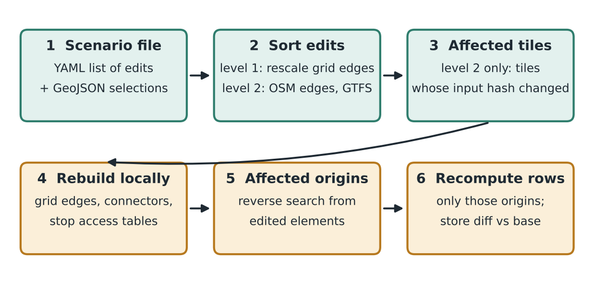

# 11. Scenario engine

## 11.1 What changes, and what it costs

Scenarios range from one speed limit to the reopening of former railway stations across France combined with a redistribution of jobs and buildings. Two properties of the outputs decide what must be recomputed:

- **For a fixed network, accessibility and the inputs of the demand models are linear in opportunities and population.** Changing where people and jobs are needs no new network search, except for cells that become origins or destinations for the first time, and land use can be interpolated year by year exactly.
- **O-D costs are minima over paths.** As functions of link times they are concave and piecewise linear, and they jump when a link or a line opens. Projects therefore cannot be interpolated; gradual changes can, within computable bounds (section 11.5).

What a land-use change needs depends on what is stored for each mode:

| Mode | Stored | Land-use change without new search |
|---|---|---|
| Walk | Full 200 m O-D table | Products recomputed by joins in DuckDB |
| Bike | Full 1 km O-D table | Same |
| PT | Stop-to-stop table per epoch (median over the window, from range RAPTOR run once from each stop area), plus access and egress tables | Backward propagation from each changed cell d: stops within 20 min on foot of d, then the stop-to-stop table, then the origins within 20 min of those stops, gives c(o, d) for every origin; curves, O-D table and nearest destinations are updated. No timetable routing; the cost grows with the number of changed cells. Checked against per-origin range RAPTOR on a sample |
| Car | 1 km table, optionally banded beyond 30 km | Joins if the full 1 km table is stored; otherwise a national re-run of car searches, tens of minutes [decision after the pilot] |

## 11.2 Event timeline: dynamic increments

A scenario is a baseline state plus dated events:

- **Land-use trajectories,** year by year: totals by EPCI and sector, population, services (for example continued metropolisation or decentralisation).
- **Network events with commissioning dates:** new lines, station reopenings, motorway sections, speed-limit changes, bike networks.

The network is constant between two consecutive event dates. Each such **network epoch** needs one routing run, full or incremental. Every year inside an epoch is table work only: the epoch's stored costs are combined with that year's opportunities and population (Figure 5). Grouping events into few epochs, for example by planning period, is the main way to control cost.


_Figure 5. Event timeline of a scenario (illustration). Land use is updated every year without routing; the network changes only at event dates, each opening an epoch with one routing run; a gradual lever is handled with bounds, with a midpoint run only if needed._

## 11.3 Automatic triage of edits

Before running, the engine classifies every edit, estimates the cost of each option and logs its choice:

| Edit | What is recomputed |
|---|---|
| More or fewer jobs, residents or services in cells already flagged | No search: products recomputed from stored costs (table of section 11.1). |
| Service closure | The second or third nearest becomes the nearest; only origins that lose all three are searched again. |
| New destination cells (new employment zone, new service, newly populated cell) | One reverse search per new cell gives its cost from every origin; for nearest-of-type, the search is pruned where the stored nearest is already closer. |
| Newly urbanised cells (new origins) | `urban_extension`: the cell's local edges take the speeds and detour factors of its built-up neighbours, with no OSM editing; one search per new origin cell. |
| Gradual network levers (speed limits, PT speed or frequency, bike comfort) | Path-fixed update from the stored components (time per road class, PT components): exact when paths do not change, otherwise an upper bound. Origins where the bound may be loose are searched again (section 11.5). |
| Few added elements (a motorway link, a few stops, a footbridge) | Forward and backward searches from each new element x, combined with the old costs: c_new(o,d) = min(c_old(o,d), min over x of c_old(o,x) + c_new(x,d)), with x the first new element on the path. Exact on static graphs; to validate for PT. The engine compares its cost with re-searching the affected origins and picks the cheaper. |
| Mixed or large packages (station reopenings across France, a regional network redesign) | Affected origins from reverse reach and stored route groups; above 30% of origins for a mode, one full run for that mode, parallel by tile. |

**Station reopenings are not pure additions.** A new stop slows every train that calls there (dwell, braking and acceleration: 2 min per added stop), so all trips using the line are affected; the stored route groups identify them without a search. The worst case for a very large scenario is one full national run per epoch, the same cost as building a reference year.

## 11.4 Edit levels and catalogue

Network edits apply at one of three levels; land-use edits form a fourth kind that never touches the networks.

| Level | What is edited | Typical edits | Assessment |
|---|---|---|---|
| 1. Derived layers | Time components of grid edges, trunk links, PT stop times, rates of legs | Speed limits by class or area; PT speed or frequency; bike comfort; PT seats and capacity | Seconds to rescale; exact when paths do not change, bounded otherwise (11.5) |
| 2. Source network | OSM edge table and GTFS, as small differences | New or removed roads and bridges, car-to-bike conversions, interchanges, new lines, extensions, stations | Rebuild of affected tiles, then triage; captures new topology and barriers |
| 3. Outputs | O-D costs directly | "Car times −5% everywhere" | Instant but without network propagation; sensitivity analysis only |
| Land use | Control totals and keys | Sector growth; business park; school opening; new park; population | Tables, plus searches for new cells only |



_Figure 6. Scenario pipeline for network edits. Level 1 edits skip the tile rebuild; level 2 edits rebuild only the tiles whose inputs changed._

| Edit | Parameters | Level | Recomputed |
|---|---|---|---|
| `road_speed` | Selection (area, class); new speed limit or factor; date | 1 | Path-fixed update; re-search where bounds are loose |
| `road_add`, `trunk_add` | Line geometry, class, speed, lanes, interchanges (motorways and major links only) | 2 | Grid edges, trunk graph and connectors in touched tiles; triage |
| `urban_extension` | Polygon of the new urbanised area; date | 2 | Local edges from neighbouring speeds; searches for new origin cells |
| `road_remove`, `car_to_bike` | Selection; car access off; bike infrastructure class | 2 | Car and bike grid edges; affected origins |
| `bike_infra` | Way ids or line geometry; infrastructure class; surface | 2 | Bike speeds, stop probabilities and energy; affected origins |
| `pt_speed`, `pt_frequency` | Routes; factor, segment times or headway by period | 1 | Stop times or trips regenerated; path-fixed update or affected origins |
| `pt_quality` | Routes; seats, capacity, standing shares | 1 | Ride energy; no search |
| `pt_extend`, `pt_new_line`, `station_reopen` | Stops, headways, speeds or segment times, dwell times | 2 | New stops and trips; walk access; affected origins via route groups |

Land-use edits: `jobs_totals` (growth by sector, zone and year), `jobs_add` (project geometry, sector, jobs), `services_edit` (open or close an equipment type at a location), `nature_add` (polygon and class), `population_update` (totals by zone and year, or new dwellings). They change the tables of sections 6 and 7 and trigger searches only for new cells (section 11.3).

## 11.5 Linearisation and bounds

- **Land use:** linear interpolation between two years is exact for accessibility at fixed costs.
- **Gradual network levers** (a speed limit lowered in steps, frequency raised over several years): for intermediate link times, O-D costs are bracketed:

```text
c(λ) ≥ (1 − λ)·c(0) + λ·c(1)
c(λ) ≤ min( C_path(0)(λ), C_path(1)(λ) )
```

The lower bound, from concavity, is the interpolation of the end-point costs. The upper bound uses fixed paths: C_path(λ) is the cost of the old or new path at the link times of step λ, computed from the stored time components. If the gap is below 2%, intermediate years are interpolated; otherwise one more epoch is computed at the midpoint.

- **Discrete projects:** a step at the commissioning date, never interpolated; ramp-up of use belongs to the demand model.
- **Packages:** the effects of single projects do not add up (section 2.5), so a package is always computed jointly; the contribution of one project is measured by leaving it out of the package.

## 11.6 Example scenario file

A scenario is a short YAML file plus GeoJSON selections, validated before running:

```text
scenario: S02_rail_revival_decentralisation
base: state_2023
horizon: 2050
epochs: [2027, 2030, 2035, 2044]          # optional grouping of events
landuse:
  - type: jobs_totals
    trajectory: macro/decentralisation.parquet   # EPCI x sector x year
events:
  - type: road_speed                      # gradual lever
    select: {highway: [secondary, tertiary], context: rural}
    maxspeed_kmh: {2027: 85, 2030: 80}
  - type: station_reopen
    date: 2035
    stations: pt/former_stations.geojson
    dwell_s: 60
  - type: bike_infra
    date: 2030
    select: {area: zones/metropoles.geojson, highway: [primary, secondary]}
    infra: separated
  - type: urban_extension
    date: 2033
    area: zones/new_district.geojson
```

## 11.7 Finding affected origins

- **Road edits.** A reverse search on the mode graph from the edited cells, with the mode cutoff, returns every origin that can reach the edit. Only those can change, so the set is a safe superset.
- **PT edits.** Origins whose stored route groups use a modified line, plus origins within walking reach of new or modified stops; a reverse search on a static lower-bound PT graph (minimum in-vehicle times, no waiting) gives a safe superset when route groups are not enough.
- **Trunk edits.** A reverse search on the combined car graph from the new or modified interchanges.

## 11.8 Consistency checks and back-test

- A scenario with no edits reproduces the baseline exactly.
- Monotonicity: adding a road or raising a speed never increases any travel time; removing never decreases one.
- Level 1 against level 2 on a sample: the same speed change applied both ways must agree within a tolerance; interpolated years stay within their bounds.
- Back-test: the 2021 baseline plus the observed changes, run incrementally, against a direct build of 2023 (section 5.5); this measures the engine's own error.
- Every run logs the edits, the option chosen for each, the tiles rebuilt and the origins recomputed, so the cost of each edit is visible.
